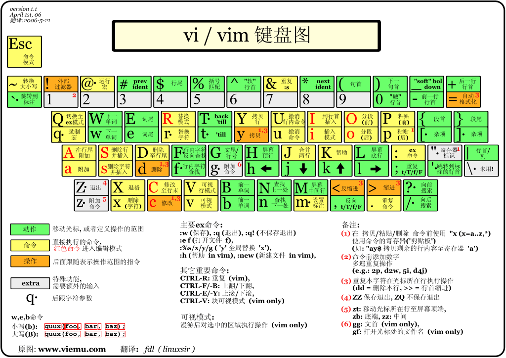
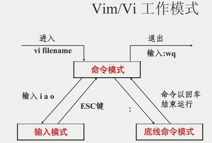
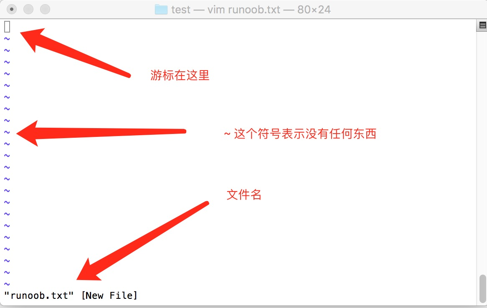

# Linux vi/vim

所有的 Unix Like 系统都会内建 vi 文书编辑器，其他的文书编辑器则不一定会存在。

但是目前我们使用比较多的是 vim 编辑器。

vim 具有程序编辑的能力，可以主动的以字体颜色辨别语法的正确性，方便程序设计。

相关文章：[史上最全Vim快捷键键位图 — 入门到进阶](https://www.runoob.com/w3cnote/all-vim-cheatsheat.html)

Vim官网：[http://www.vim.org](http://www.vim.org/)

## 什么是 vim？

Vim 是从 vi 发展出来的一个文本编辑器。代码补完、编译及错误跳转等方便编程的功能特别丰富，在程序员中被广泛使用。

简单的来说， vi 是老式的字处理器，不过功能已经很齐全了，但是还是有可以进步的地方。 vim 则可以说是程序开发者的一项很好用的工具。

连 vim 的官方网站 ([http://www.vim.org](http://www.vim.org/)) 自己也说 vim 是一个程序开发工具而不是文字处理软件。

vim 键盘图：



## vi/vim 的使用

基本上 vi/vim 共分为三种模式，分别是**命令模式（Command mode）**，**输入模式（Insert mode）**和**底线命令模式（Last line mode）**。 这三种模式的作用分别是：

## 命令模式

用户刚刚启动 vi/vim，便进入了命令模式。

此状态下敲击键盘动作会被 Vim 识别为命令，而非输入字符。比如我们此时按下 i，并不会输入一个字符，i 被当作了一个命令。

以下是常用的几个命令：

- **i** **切换到输入模式，以输入字符。**

- **x** **删除当前光标所在处的字符。**

-  **:** **切换到底线命令模式，以在最底一行输入命令。**

若想要编辑文本：启动 Vim，进入了命令模式，按下 i，切换到输入模式。

命令模式只有一些最基本的命令，因此仍要依靠底线命令模式输入更多命令。

## 输入模式

在命令模式下按下 i 就进入了输入模式。

在输入模式中，可以使用以下按键：

·    **字符按键以及Shift组合**，输入字符

·    **ENTER**，回车键，换行

·    **BACK SPACE**，退格键，删除光标前一个字符

·    **DEL**，删除键，删除光标后一个字符

·    **方向键**，在文本中移动光标

·    **HOME**/**END**，移动光标到行首/行尾

·    **Page Up**/**Page Down**，上/下翻页

·    **Insert**，切换光标为输入/替换模式，光标将变成竖线/下划线

·    **ESC**，退出输入模式，切换到命令模式

## 底线命令模式

在命令模式下按下:（英文冒号）就进入了底线命令模式。

底线命令模式可以输入单个或多个字符的命令，可用的命令非常多。

在底线命令模式中，基本的命令有（已经省略了冒号）：

·    **q** **退出程序**

·    **q！强制退出不保存**

·    **w** **保存文件**

·    **wq 保存并退出**

按ESC键可随时退出底线命令模式。

简单的说，我们可以将这三个模式想成底下的图标来表示：



## 使用 vi/vim 进入一般模式

如果你想要使用 vi 来建立一个名为 runoob.txt 的文件时，你可以这样做：

```
$ vim runoob.txt
```

直接输入 **vim** **文件名** 就能够进入 vim 的一般模式了。请注意，记得 vim 后面一定要加文件名，不管该文件存在与否！




- 按下 i 进入输入模式(也称为编辑模式)，开始编辑文字

在一般模式之中，只要按下 i, o, a 等字符就可以进入输入模式了！

在编辑模式当中，你可以发现在左下角状态栏中会出现  –INSERT-  的字样，那就是可以输入任意字符的提示。

这个时候，键盘上除了 **Esc** 这个按键之外，其他的按键都可以视作为一般的输入按钮了，所以你可以进行任何的编辑。


- 按下 ESC 按钮回到一般模式

好了，假设我已经按照上面的样式给他编辑完毕了，那么应该要如何退出呢？是的！没错！就是给他按下 **Esc** 这个按钮即可！马上你就会发现画面左下角的 –INSERT– 不见了！


- 在一般模式中按下 **:wq** 储存后离开 vim

OK，我们要存档了，存盘并离开的指令很简单，输入 **:wq** 即可保存离开！


OK! 这样我们就成功创建了一个 runoob.txt 的文件。


## vi/vim 按键说明

除了上面简易范例的 i, Esc, :wq 之外，其实 vim 还有非常多的按键可以使用。

### 第一部分：一般模式可用的光标移动、复制粘贴、搜索替换等

| 移动光标的方法                                               | 说明                                                         |
| ------------------------------------------------------------ | ------------------------------------------------------------ |
| h 或 向左箭头键(←)                                           | 光标向左移动一个字符                                         |
| j 或 向下箭头键(↓)                                           | 光标向下移动一个字符                                         |
| k 或 向上箭头键(↑)                                           | 光标向上移动一个字符                                         |
| l 或 向右箭头键(→)                                           | 光标向右移动一个字符                                         |
|                                                              |                                                              |
|                                                              |                                                              |
| 如果你将右手放在键盘上的话，你会发现hjkl是排列在一起的，因此可以使用这四个按钮来移动光标。如果想要进行多次移动的话，例如向下移动 30 行，可以使用"30j"或"30↓" 的组合按键，亦即加上想要进行的次数(数字)后，按下动作即可！ |                                                              |
|                                                              |                                                              |
|                                                              |                                                              |
| [Ctrl] + [f]                                                 | 屏幕『向下』移动一页，相当于 [Page Down]按键 (常用)          |
| [Ctrl] + [b]                                                 | 屏幕『向上』移动一页，相当于 [Page Up] 按键 (常用)           |
| [Ctrl] + [d]                                                 | 屏幕『向下』移动半页                                         |
| [Ctrl] + [u]                                                 | 屏幕『向上』移动半页                                         |
| +                                                            | 光标移动到非空格符的下一行                                   |
| **-**                                                        | 光标移动到非空格符的上一行                                   |
| n<space>                                                     | 那个 n 表示『数字』，例如 20 。按下数字后再按空格键，光标会向右移动这一行的 n 个字符。例如 20<space> 则光标会向后面移动 20 个字符距离。 |
| **0** **或功能键**[Home]                                     | 这是数字『 0 』：移动到这一行的最前面字符处 (常用)           |
| $ 或功能键[End]                                              | 移动到这一行的最后面字符处(常用)                             |
| H                                                            | 光标移动到这个屏幕的最上方那一行的第一个字符                 |
| M                                                            | 光标移动到这个屏幕的中央那一行的第一个字符                   |
| L                                                            | 光标移动到这个屏幕的最下方那一行的第一个字符                 |
| **G**                                                        | 移动到这个档案的最后一行(常用)                               |
| nG                                                           | n 为数字。移动到这个档案的第 n 行。例如 20G 则会移动到这个档案的第 20 行(可配合 :set nu) |
| **gg**                                                       | 移动到这个档案的第一行，相当于 1G 啊！ (常用)                |
| n<Enter>                                                     | n 为数字。光标向下移动 n 行(常用)                            |
| **搜索替换**                                                 |                                                              |
| **/word**                                                    | 向光标之下寻找一个名称为 word 的字符串。例如要在档案内搜寻 vbird 这个字符串，就输入 /vbird 即可！ (常用) |
| **?word**                                                    | 向光标之上寻找一个字符串名称为 word 的字符串。               |
| **n**                                                        | 这个 n 是英文按键。代表重复前一个搜寻的动作。举例来说， 如果刚刚我们执行 /vbird 去向下搜寻 vbird 这个字符串，则按下 n 后，会向下继续搜寻下一个名称为 vbird 的字符串。如果是执行 ?vbird 的话，那么按下 n 则会向上继续搜寻名称为 vbird 的字符串！ |
| N                                                            | 这个 N 是英文按键。与 n 刚好相反，为『反向』进行前一个搜寻动作。 例如 /vbird 后，按下 N 则表示『向上』搜寻 vbird 。 |
| 使用 /word 配合 n 及 N 是非常有帮助的！可以让你重复的找到一些你搜寻的关键词！ |                                                              |
| :n1,n2s/word1/word2/g                                        | n1 与 n2 为数字。在第 n1 与 n2 行之间寻找 word1 这个字符串，并将该字符串取代为 word2 ！举例来说，在 100 到 200 行之间搜寻 vbird 并取代为 VBIRD 则：   『:100,200s/vbird/VBIRD/g』。(常用) |
| **:1,$s/word1/word2/g** 或 **:%s/word1/word2/g**             | 从第一行到最后一行寻找 word1 字符串，并将该字符串取代为 word2 ！(常用) |
| **:1,$s/word1/word2/gc** 或 **:%s/word1/word2/gc**           | 从第一行到最后一行寻找 word1 字符串，并将该字符串取代为 word2 ！且在取代前显示提示字符给用户确认 (confirm) 是否需要取代！(常用) |

 

| **删除、复制与贴上**                                         |                                                              |
| ------------------------------------------------------------ | ------------------------------------------------------------ |
| **x, X**                                                     | **在一行字当中，****x** **为向后删除一个字符** **(****相当于** **[del]** **按键****)****，** **X** **为向前删除一个字符****(****相当于** **[backspace]** **亦即是退格键****) (****常用****)** |
| **nx**                                                       | **n** **为数字，连续向后删除** **n** **个字符。举例来说，我要连续删除** **10** **个字符，** **『****10x****』。** |
| **dd**                                                       | **删除游标所在的那一整行****(****常用****)**                 |
| **ndd**                                                      | **n** **为数字。删除光标所在的向下** **n** **行，例如** **20dd** **则是删除** **20** **行** **(****常用****)** |
| d1G                                                          | 删除光标所在到第一行的所有数据                               |
| **dG**                                                       | **删除光标所在到最后一行的所有数据**                         |
| **d$**                                                       | **删除游标所在处，到该行的最后一个字符**                     |
| **d0**                                                       | **那个是数字的** **0** **，删除游标所在处，到该行的最前面一个字符** |
| **yy**                                                       | **复制游标所在的那一行****(****常用****)**                   |
| **nyy**                                                      | **n** **为数字。复制光标所在的向下** **n** **行，例如** **20yy** **则是复制** **20** **行****(****常用****)** |
| **y1G**                                                      | **复制游标所在行到第一行的所有数据**                         |
| **yG**                                                       | **复制游标所在行到最后一行的所有数据**                       |
| **y0**                                                       | **复制光标所在的那个字符到该行行首的所有数据**               |
| **y$**                                                       | **复制光标所在的那个字符到该行行尾的所有数据**               |
| p, P                                                         | p 为将已复制的数据在光标下一行贴上，P 则为贴在游标上一行！ 举例来说，我目前光标在第 20 行，且已经复制了 10 行数据。则按下 p 后， 那 10 行数据会贴在原本的 20 行之后，亦即由 21 行开始贴。但如果是按下 P 呢？ 那么原本的第 20 行会被推到变成 30 行。 (常用) |
| J                                                            | 将光标所在行与下一行的数据结合成同一行                       |
| c                                                            | 重复删除多个数据，例如向下删除 10 行，[ 10cj ]               |
| **u**                                                        | **复原前一个动作。****(****常用****)**                       |
| **[Ctrl]+r**                                                 | **重做上一个动作。****(****常用****)**                       |
| 这个 u 与 [Ctrl]+r 是很常用的指令！一个是复原，另一个则是重做一次～ 利用这两个功能按键，你的编辑，嘿嘿！很快乐的啦！ |                                                              |
| .                                                            | 不要怀疑！这就是小数点！意思是重复前一个动作的意思。 如果你想要重复删除、重复贴上等等动作，按下小数点『.』就好了！ (常用) |

### 

### 第二部分：一般模式切换到编辑模式的可用的按钮说明

| **进入输入或取代的编辑模式**                                 |                                                              |
| ------------------------------------------------------------ | ------------------------------------------------------------ |
| i, I                                                         | 进入输入模式(Insert mode)：   i 为『从目前光标所在处输入』， I 为『在目前所在行的第一个非空格符处开始输入』。 (常用) |
| a, A                                                         | 进入输入模式(Insert mode)：   a 为『从目前光标所在的下一个字符处开始输入』， A 为『从光标所在行的最后一个字符处开始输入』。(常用) |
| o, O                                                         | 进入输入模式(Insert mode)：   这是英文字母 o 的大小写。o 为在目前光标所在的下一行处输入新的一行； O 为在目前光标所在的上一行处输入新的一行！(常用) |
| r, R                                                         | 进入取代模式(Replace mode)：   r 只会取代光标所在的那一个字符一次；R会一直取代光标所在的文字，直到按下 ESC 为止；(常用) |
| 上面这些按键中，在 vi 画面的左下角处会出现『--INSERT--』或『--REPLACE--』的字样。 由名称就知道该动作了吧！！特别注意的是，我们上面也提过了，你想要在档案里面输入字符时，  一定要在左下角处看到 INSERT 或 REPLACE 才能输入喔！ |                                                              |
| [Esc]                                                        | 退出编辑模式，回到一般模式中(常用)                           |

 

  

| **vim** **环境的变更** |                                                    |
| ---------------------- | -------------------------------------------------- |
| :set nu                | 显示行号，设定之后，会在每一行的前缀显示该行的行号 |
| :set nonu              | 与 set nu 相反，为取消行号！                       |

特别注意，在 vi/vim 中，数字是很有意义的！数字通常代表重复做几次的意思！ 也有可能是代表去到第几个什么什么的意思。

举例来说，要删除 50 行，则是用 『50dd』 对吧！ 数字加在动作之前，如我要向下移动 20 行呢？那就是『20j』或者是『20↓』即可。

 

## vim 中批量添加注释

方法一 ：块选择模式

批量注释：

Ctrl + v 进入块选择模式，然后移动光标选中你要注释的行，再按大写的 I 进入行首插入模式输入注释符号如 // 或 #，输入完毕之后，按两下 ESC，Vim 会自动将你选中的所有行首都加上注释，保存退出完成注释。

取消注释：

Ctrl + v 进入块选择模式，选中你要删除的行首的注释符号，注意 // 要选中两个，选好之后按 d 即可删除注释，ESC 保存退出。

方法二: 替换命令

批量注释。 

使用下面命令在指定的行首添加注释。

使用名命令格式： :起始行号,结束行号s/^/注释符/g（注意冒号）。

取消注释：

使用名命令格式： :起始行号,结束行号s/^注释符//g（注意冒号）。

例子：

 

1、在 10 - 20 行添加 // 注释

:10,20s#^#//#g

2、在 10 - 20 行删除 // 注释

:10,20s#^//##g

3、在 10 - 20 行添加 # 注释

:10,20s/^/#/g

4、在 10 - 20 行删除 # 注释

:10,20s/#//g

vim快捷键补充（插入模式）

自动补全：ctrl + n

\p< 插入一个include，并把光标置于<>中间

\im 插入主函数

\ip 插入printf，并自动添加\n，且把光标置于双引号中间

vim快捷键补充（编辑模式）

dw 删除一个单词（配合b：将光标置于所在单词的首部）

yw 复制一个单词（配合p：粘贴）

vim快捷键补充（插入与编辑模式通用）

\rr 运行程序

\rc 保存并编译程序（会生成二进制文件）

\# 缩进

shift + < 或者 shift + < 用于单行缩进

v、方向键、=以及shif+<>可以实现多行缩进

首先按下v然后移动方向键用于选取区域，然后再配合shift+ <>实现块的左右缩进；选中块之后按=与选中区域的上一行对齐缩进

 

终端输出的内容用鼠标双击可以点中

## vimdiff

1.打开两个文件进行diff

`vimdiff file1 file2`

2. 将diff从另一个文件中拉过来

  首先移动到当前文件中的 diff 处（光标应该移动到diff末尾，该diff只有另一个文件中有），然后执行do，可以将 diff 从对面文件拉到对应位置

3. 将 diff 放到另一个文件中，首先将光标移动到 diff 处（光标位于 diff 末尾，该 diff 只有当前文件有），然后执行 dp，可以将 diff 推到另一个文件中

4. 不同行的 diff 处理可以结合 ctrl + w（在两个文件中进行跳转）和基本 diff 命令进行。

比如想要把对面文件的 1～4 行复制到当前文件，则可以两次输入 ctrl + w 从而跳转到对面窗口，然后将光标移动到第四行，执行 4yy 进行复制，然后再输入两次 ctrl + w 跳回原来的窗口，将光标移动到指定位置之后，执行 p 命令即可。 

 ```
 ]c [c 分别可以跳转到下一个与上一个 diff
 
 2[c 可以跳到往前第二个diff
 
 2]c 可以跳到往后第二个diff
 
 ctrl + w 输入两次可以切换到对面窗口
 
 do 用于拉取 diff 到同一行
 
 dp 用于推送 diff 到同一行
 
 diffupdate 用于在修改文件内容后更行 diff 状态，vim 其实会自己更新，但是有时候也会更新失败，所以需要在修改文件内容之后再输入 diffupdate
 
 u 命令可以正常使用，不过要注意光标一定要放在需要撤销修改的文件内
 
 qa 命令可用于同时退出两个窗口，不保存修改
 
 wq 命令可以用于同时保留对两个文件的修改
 
 wqa 命令用于同时保存对两个文件的修改，并关闭两个窗口
 
 set diffopt=context:6 命令用于将diff的上下文修改为6行，即diff前后会展示6行原始文件内容 
 ```


